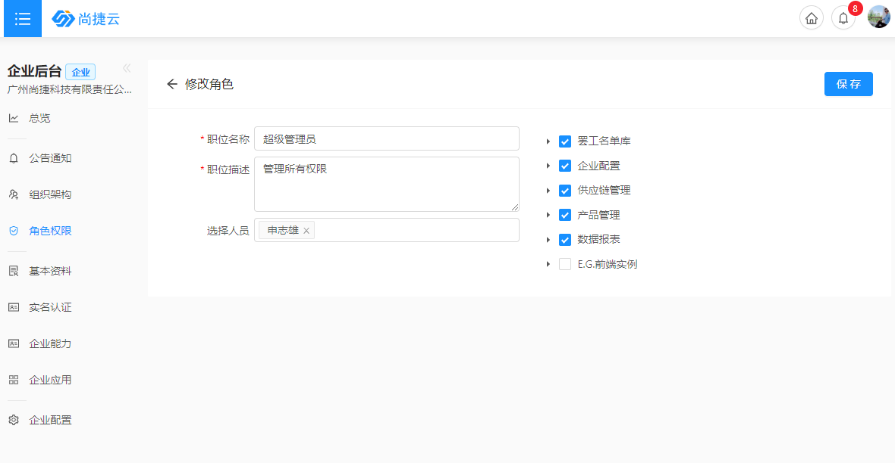

# 跟单通操作手册

本章节如何教你如何使用跟单通

## 一、基础资料

### 员工管理-员工注册、导入

企业管理-->员工管理

批量新增，下载EXCEL再上传，批量增加员工;

一键注册：把批量增加的员工激活，可登录系统(不让员工登录系统可以不激活);

新增员工：增加一条数据

### 员工管理-配置权限

企业管理-->职位权限

保存：保存职位信息;

选择人员：只有激活的员工可进行选择;

配置权限：可看到企业购买应用的所有模块.

### 基础资料-增加 颜色，尺码

基础资料-->字典管理

### 基础资料-增加品类管理

基础资料-->品类管理

### 基础资料-增加生产节点

基础资料-增加不同流程的名称

基础资料-配置流程的生产节点环节及顺序

### 基础资料-增加不同流程的名称

供应链管理-->基础资料-->流程管理

### 基础资料-配置流程的生产节点环节及顺序

供应链管理-->基础资料-->生产流程管理

## 二、供应商管理

### 规则定义-负责供应商准入的条件，设定转入规则

供应商管理-->规则定义

新增：增加需要定义的规则，点击右上角的新增按钮即可。

评分题库：针对于需要评分的内容，在这里建立一个题库。

评分规则：针对于不同的内容制定不同的规则，形成相应的分数，例如良好、优秀等。

验厂规则：对工厂检验的标准规则定义，例如：厂房规模（面积）、厂房性质等。

试单规则：对工厂检验通过后，进行初步合作的订单生产的规则，例如：订单数量、订单金额等。

试单规则-供应商：对检验工厂关联的供应商，定义的规则评分，例如：供应商的数量，供应商的质量等。

### 供应商拜访-记录业务人员地推了多少个供应商，申请验厂

供应商管理-->供应商拜访

供应商拜访：列表展示供应商拜访的所有信息

新增：新增供应商拜访记录

验厂报告(移动端)：供应商管理-->我的工作-->验厂完成，生成一份验厂报告

### 供应商基本档案，能力管理

供应商管理，对机器人员能力的掌控，为排单做准备
基于供应商的基本资料，并对机器，人员结构，人员技能等静态能力数据进行有效管理，掌控供应商的基本能力

## 三、尚上之选

### 订货会场景

### 商品列表

产品管理-->商城后台-->商品列表

### 商品上传

产品管理-->商城后台-->商品列表-->新增

必填项都是标红星，保存即可。

封面图：商城第一张。

轮播图：查看多张的图片，限制大小为100KB。

客款号：客户填写。

款号：系统自动生成。

库存：有库存则填，没库存则不填写。

价格：最低价和最高价(订单量大量小)。

拿货价：给予我方的价格。

生产周期：已起批量的数量来制定。

价格区间：设定订单数量规则，数量大的区间给予价格(可不填)。

商品来源：选择是哪个供应商提供的货物。

品牌：选企业的哪个品牌即可

详情：上传一些尺寸图，细节图等。

### 微信扫码

产品管理-->商城后台-->商品列表-->打印

图片对应移动端位置

移动端查看详情效果

微信扫码进入商城页

### 扫码看效果

勾选某一个商品，鼠标点击设置图标，再点击打印。

显示二维码，微信扫码即可进入商城。

### 商品导出

勾选某一个/多个商品，点击导出，自动导出EXCEL文档

### 下单合同-加入购物车的数据

统计加入购物车产品有哪些，什么时候加入的。

业务人可根据这些数据进行分析和跟踪。

### 下单合同-所有下单的数据可导出

统计渠道商/客户下单的数据，是订货的还是走的现货的，多少款，多少数量，可导出Excel。

### 绑定公众号

跟公众号绑定后，有新的款式信息；会发送一条推送消息给你；

有异常问题也会推送消息给您，让你尽快处理；

点击对应款式，进入款式提交页面；

## 四、订单进度

### 业务订单--订单池

供应商管理-电商流程-业务订单

搜索:根据客户名称，客款号，商品名称
高级搜索：交期，客款号。

打印:选中一个款后鼠标点击打印显示打印格式及内容。

新增:增加订单信息。

### 业务订单--打印格式

### 业务订单--EXCEl导入

### 业务订单--添加款式

供应链管理-->电商流程-->业务订单-->新增

*为必填项

客户:来源供应链管理-客户管理-客户档案。

图片上传一张；

客款号：大货号，从大货版单中抓数据；

款号：设计号，从产品中抓数据；

进度模板：前期设定默认进度跟进模板，订单一进来，默认选择即可提交进度；

批次:款式批次分多少批次。

追加:多增加一个款的信息。

删除本:删除当前的一组数据，但最少存在一个款才可以删除。

注：每个款的颜色上限为12个

### 款式派单

供应链管理-->电商流程-->款式派单

列表：显示所有未完成的订单数据；

搜索：客户名称，订单编号模糊搜索；

筛选：客款号，交期；

点击某一款，对此款操作派单，分配组别；

追加：追加一组数据，分多个小组做，可按明细添加/总数量添加；

保存：保存编辑的内容；

剩余总数量：显示还有多少未排，超过则红色标识。

注:小组来源于”企业配置-企业管理-部门结构” 生产部下的小组。

用户可以对之前的分配记录进行修改(包括颜色尺码数量信息)

### 订单流程-排生产节点

供应链管理-->电商流程-->订单流程

根据货期倒着往前推算每个节点的开始跟结束时间(小时)；

节点有设置默认责任人时，自动带出，可更改；

紧急单：选择某一款做紧急调度单，优先做此款；

保存：保存成功，进度更新，可提交进度。

注: 企业工作时间在企业的基本资料里设置上班时间

推算时间按照企业的工作时间来推算,如果没有设置则按上午:8:00-12:00 下午:13.30:18.30 晚上:19.30-21.30

末节点:款式最后一个结束的节点，此节点结束后代表整个款结束完成了。

### 款式进度-提交跟进每款的进度

供应链管理-->电商流程-->款式进度

列表：节点内容，只显示当前登录人所负责的节点；

全部：显示所有款生产节点有哪些，分别什么状态；

单个节点：如【产品企划】-此节点下面有多少个款在进行中；

倒计时：超过预期时间，红色标识并发送消息给负责人；

提交进度：提交对应节点所需要填写的内容，异常或者已完成；可查看提交日志；

分配批次：把款分给不同的客户或者渠道商

### 款式进度-汇报进度

供应链管理-->电商流程-->款式进度-->提交进度

保存:提交节点信息及说明，可反复提交(节点设置可反复提交)

更改计划时间:修改节点的计划开始和结束时间。

确认完成:完成节点,完成后不能提交。

更换负责人:交接给其他人

注意:每个节点存在三种类型(数值型、二维表型、布尔型)

数值型:提交总数

二维表型:提交颜色尺码数量信息

布尔型:YES/NO

提交异常类型会发送一条异常信息给异常类型的管理人员。

### 移动端报进度(h5)

款式进度->流程进度

从微信端登录成功，进入系统后，显示当前用户负责的节点及相关的款式信息。

扫描:扫描条形码进行款式的搜索。

报表:7天内预计需要发货的款式信息。

报数:对节点进度提交与查看。

微信-->扫码-->登录-->款式进度-->流程进度-->详情-->提交进度

点击报数进入节点详情页面,显示页面款式及节点和提交日志相关信息；

提交:根据节点类型(数值型、二维表型、布尔型)进行提交；

提交并完成:提交节点信息并完成此节点。

## 五、报表

### 下单后的订货会报表

### 供应商从的品质，货期，产能占比来进行画像

供应链管理-->电商流程-->电商报表-->生产进度汇总

D：进行中

Y:   完成

N:  异常

### 节点报表-每个节点下有多少个款，可看全部

供应链管理-->电商流程-->电商报表-->节点报表

### 生产节点监控中心-直观清晰看节点进度出异常

供应链管理-->电商流程-->电商报表-->生产计划执行监控中心

### 生产车间看板-每组当日生产的款式

数据报表-->数据报表-->APS-->今日生产看板

## 联系我们

详细地址：广州市番禺区城业大厦301室
联系电话：130 4069 5589
联  系  人：周小姐
邮政编号：511000
邮箱地址：Snowy.zhou@zcylgz.com
微信号码：Share_zhou (手机号亦可)
QQ 号码：250098404

