# 尚上之选 操作手册

http://b2b.saas123.com

商城采用 B2B+B2C 的模式，打造优质交互平台

尚上优选是一个综合性的商城平台，类似于阿里巴巴，用户及企业可以在商城浏览商品、下单；管理员可以在平台管理系统中对商城的商品、订单等进行管理和跟踪

# 一、注册并加入企业

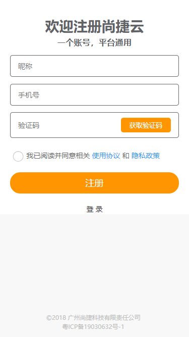 

扫码加入企业，通过 微信、QQ、 钉钉 等途径，发送二维码或是邀请链接

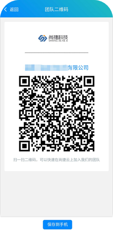 
# 二、上传商品

尚捷云 www.saas123.com

登录尚捷云，选择  产品管理 > 商城后台 > 商品列表；填写完相关信息后即完成一个商品的新增。上传成功后，即可在商城下单
价格区间：下单数量及价格阶段

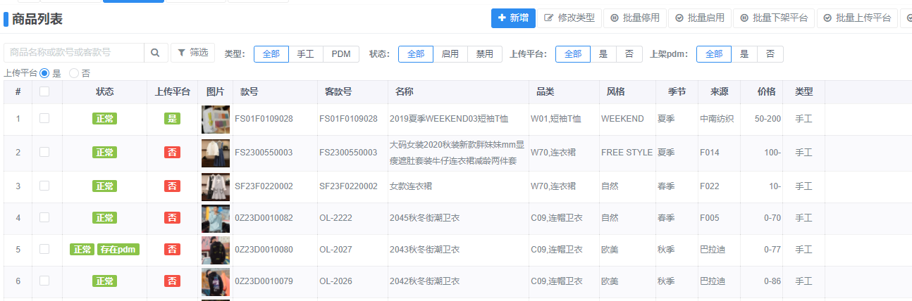

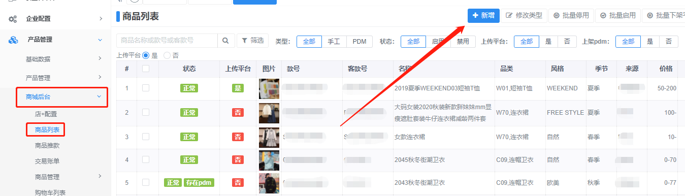

# 三、商品下单

选择相应商品查看详情，输入需要的颜色及尺码数量，即可将当前商品加入购物车

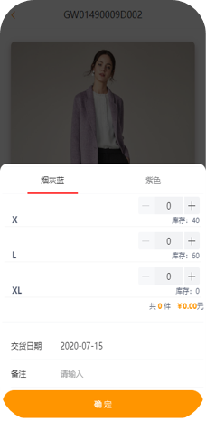

点击 购物车，勾选相应的商品，统一结算，点击 提交订单即可对商品下单，现货和订货可同时勾选下单

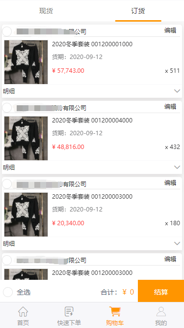

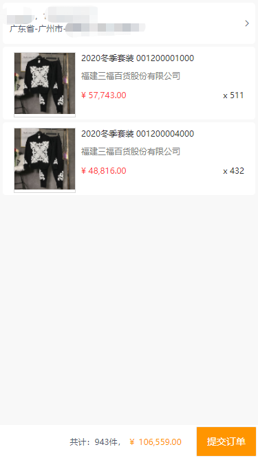

# 四、订单跟踪

点击  我的 > 查看全部(我的订单) 即可看到所有订单以及状态

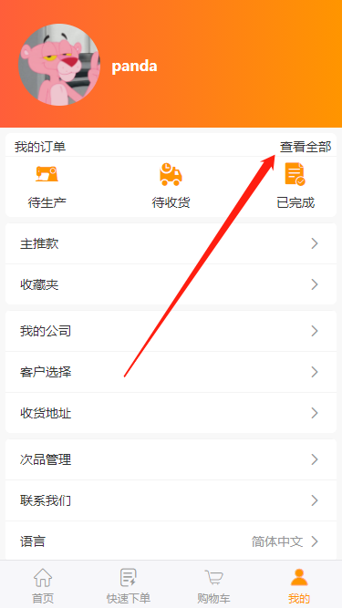

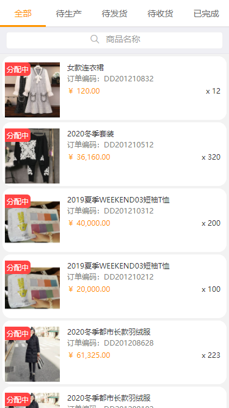

订单详情
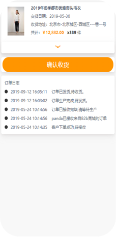

## 订单售后

若商品需要退货，可点击 申请退货  提交当前商品

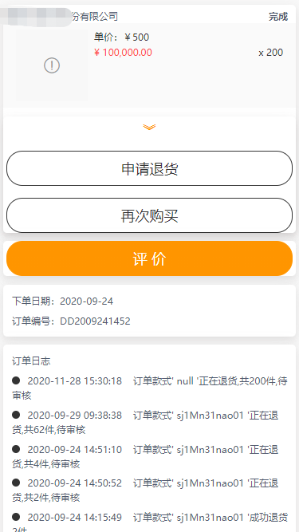

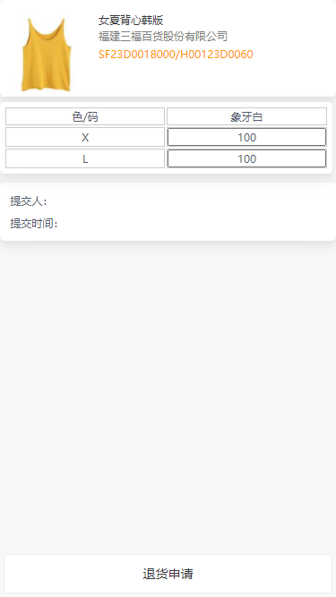

点击 > 次品详情，可查看所有提交售后的订单

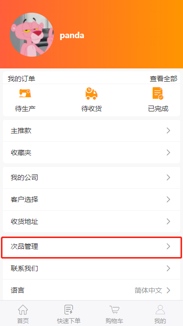

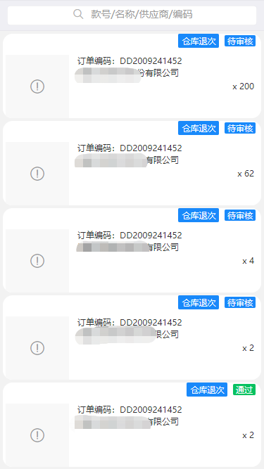

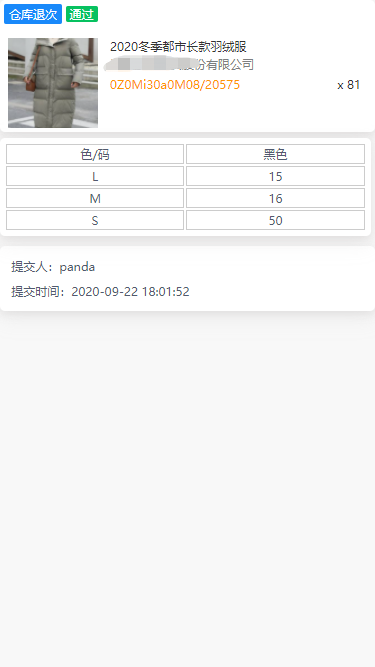

