# 成本核价操作手册

本章节教你如何使用COS系统

## 一、基本资料

### 加工费用的

产品管理-->成本核价-->加工费用

新增列表信息：定义每个品类的基本加工费，为快速报价做准备。

EXCEL导入：下载模板后，导入文件，自动覆盖到列表。

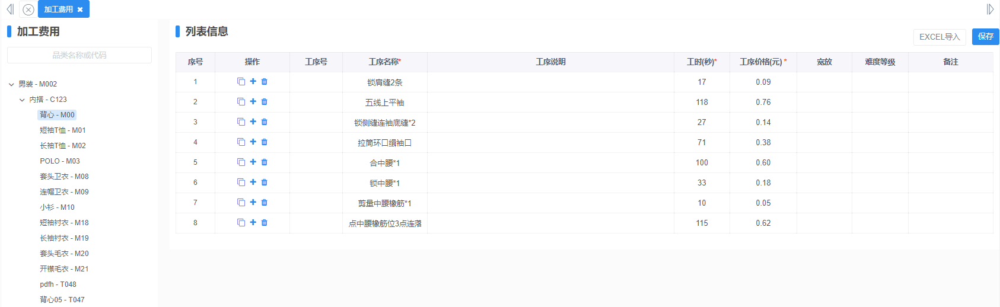

### 其他费用

产品管理-->成本核价-->其他费用

新增：特殊工艺、运费、检测费…其他费用；规范定义，统一价格标准，成本计算更精准。

导入：下载模板，填写其他费用信息，一键上传到页面。

导出：导出列表中定义的信息，电脑上同步查看EXCEL文件。

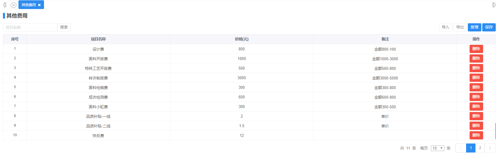

### 成本模板

产品管理-->成本核价-->成本模板

新增：根据不同公司定义固定化模板。

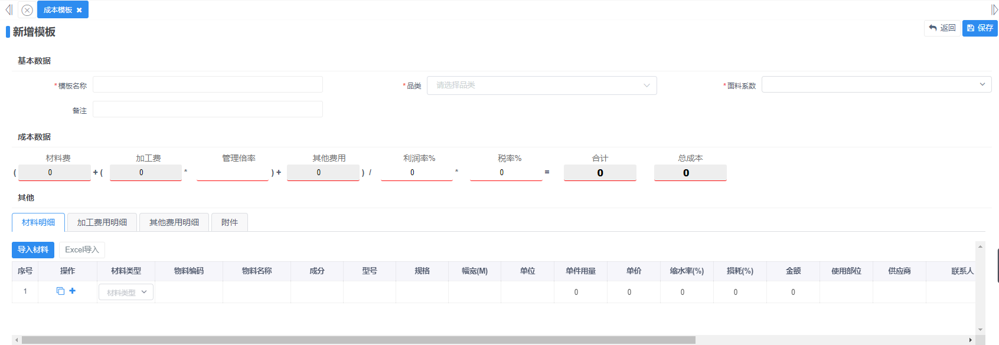

### 面料档案

产品管理-->基础数据-->面料档案

新增：定义面料费用，为快速报价做准备。

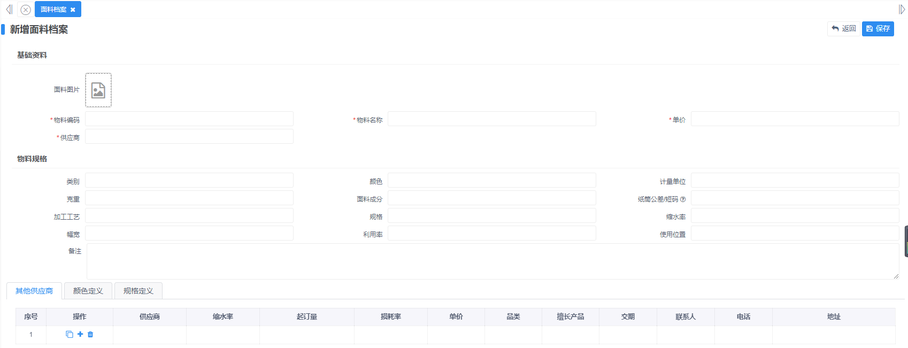

### 辅料档案

产品管理-->基础数据-->辅料档案

新增：定义辅料费用，为快速报价做准备。

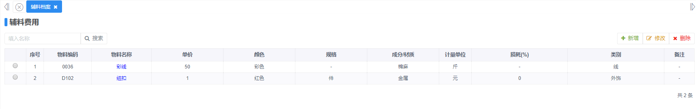

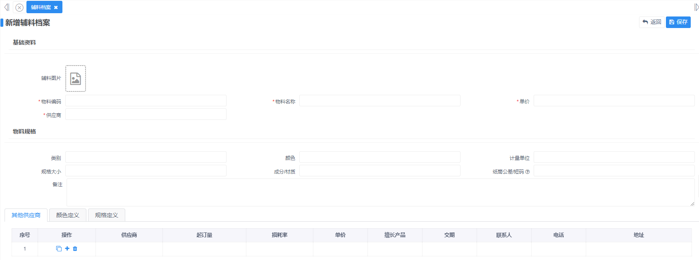

## 二、成本核价

### 成本核价列表页面

产品管理-->成本核价-->成本核价

各部门随时查看报价，让业务人员也能直接给客户快速报价，保住最高的利润，降低生产的成本。

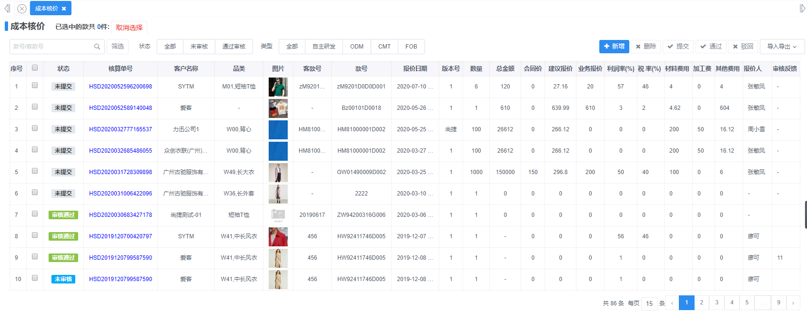

### 增加核价单-报价清晰、公式简单易懂

产品管理-->成本核价-->成本核价-->新增

必填项都是标红星，保存即可。

材料费用/加工费用/其他费用均可根据基础档案导入或者选择自定义新增。

选客户，选物料，选辅料，选加工费用，选其他费用，得到报价。

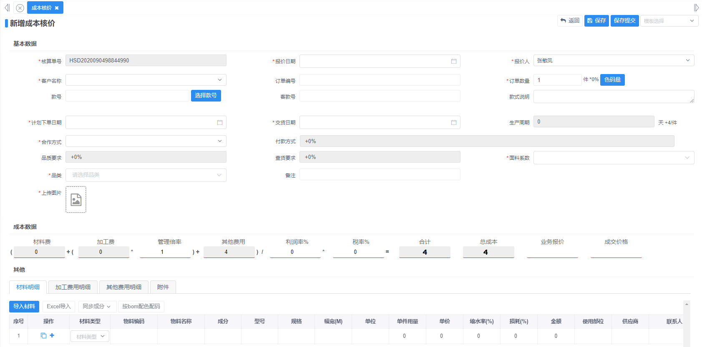

### 一键导入制版单

引用版单信息，快速给出报价，节约时间和成本。

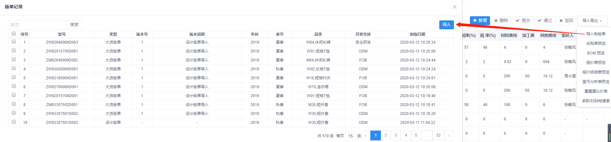

### 一键对不同款多次报价

以当前数据为基础再次给出一个报价单，针对于同一个款不同客户来形成不同核价单。

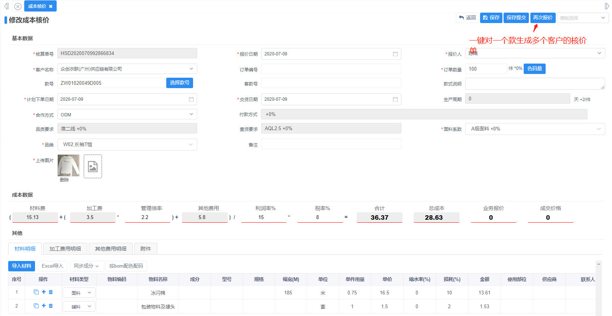

### 实时审核

对核价单实时审核，线上数据同步管理。

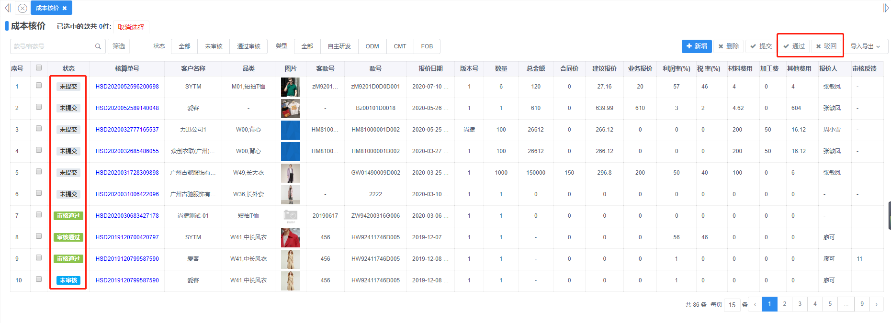

## 三、报表(先预览再导出)

### 预览采购单

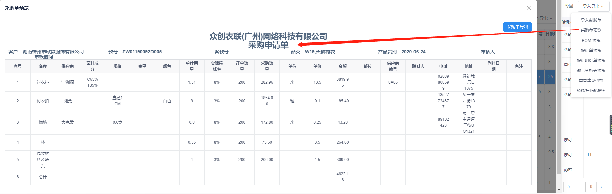

### 预览BOM清单

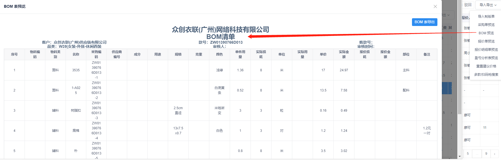

### 预览报价明细单

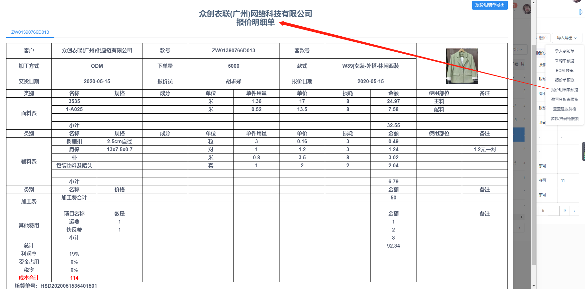

### 预览盈亏分析表

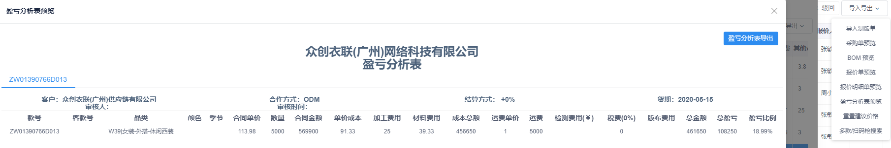

