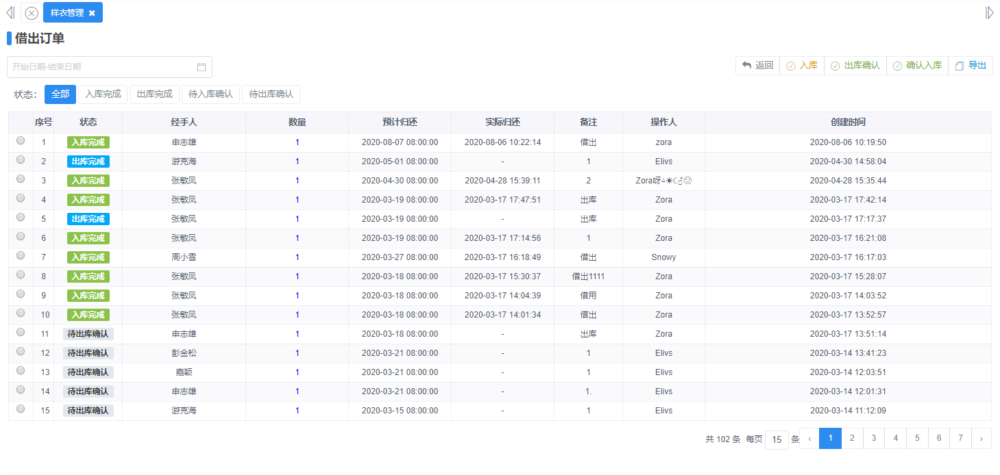
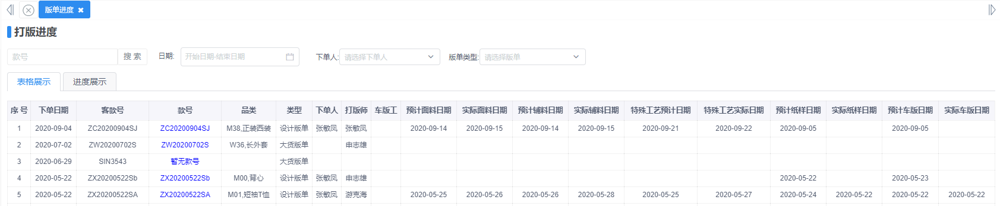

# PDM操作手册

本章节教你如何使用pdm系统

## 一、基础资料

### 字典管理

企业配置-->基础管理-->字典管理

新增基础资料的信息，例如：颜色、季节、尺码等，为新增款式做准备。

## 二、款式管理

### 款式管理

产品管理-->产品管理--款式管理

款式列表：展示款式的基本信息。

### 款式新增

产品管理-->产品管理--款式管理-->新增

必填项都是标红星，保存即可。

其他基本信息根据款式的需求来决定。

### 款式资料包管理

产品管理-->产品管理--款式管理-->详情

商品通过填写产品详情、开版、报价等步骤，自动生成资料包，资料包可在线查看，也可直接打印。

### 款式规则定义

产品管理-->产品管理--款式管理-->规则定义

定义款式规则：定义完成后，款式可以根据定义的数据，系统自动生成，无法增加。

### 打印条码和二维码

产品管理-->产品管理--款式管理-->打印

扫描二维码得知商品位置，并且直接扫码进入尚上之选商城。

### 导入

#### 批量新增商品

产品管理-->产品管理--款式管理-->导入

一次性导入多个商品，一键新增到款式列表。

#### 单款SKU导入

产品管理-->产品管理--款式管理-->单款SKU导入

单款导入：上传文件即可导入。

## 三、样衣管理

### 样衣管理

产品管理-->产品管理--样衣管理

### 样衣新增

产品管理-->产品管理--样衣管理-->新增

必填项都是标红星，保存即可。

### 订单出入库管理

产品管理-->产品管理--样衣管理-->借出订单

把控样衣出入库的去向，一键查看样衣当前位置和当前状态，防止样衣丢失和数据遗失。

### 扫码枪批量出入库

产品管理-->产品管理--样衣管理-->扫码枪出入库

使用扫码枪进行批量出入库的操作，方便快捷，节约时间成本。

## 四、报表

### 打版进度报表

供应链管理-->进度报表--打版进度

此页面主要是展示款式开版的过程当中，实时查看进度，可选择表格/进度的形式展示。

### 样衣进销存报表

产品管理-->报表--样衣报表

管理样衣进销存的数据，把控样衣的去向，防止丢失。

### 

