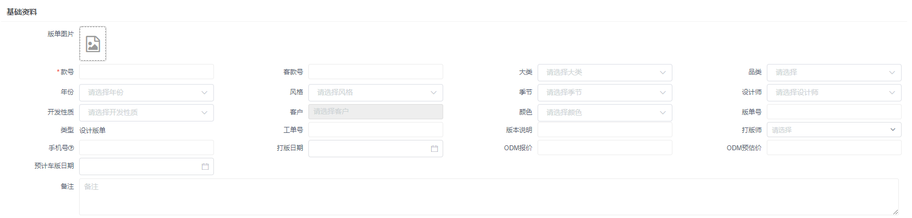
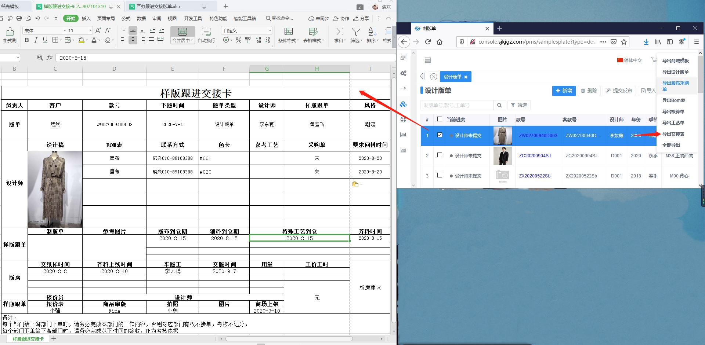

# PMS操作手册

本章节如何教你如何使用pms系统

版单分为三个板块：设计版单、产前样版单、大货版单

## 一、基础资料

新增版单资料：如基础资料、BOM资料(共八个板块)

### 基本资料-基础信息的定义

### 物料清单-增加BOM清单

### 特殊工艺

### 部位尺码

### 工序工价

### 工艺说明

### 内配配品

### 上传附件

新增附件：点击图中的大图标后弹框显示新增附件，选择文件后确定即可新增附件。

### 修改日志

点击【修改日志】即可查看历史修改的信息

## 二、采购清单

产品管理-->制版管理--采购清单

该页面主要是对于“车版工审核通过”后的数据新增一个采购，也可进行抢单、采购完成、采购入库的操作及导出样板跟进单。

## 三、报表

### 制版单报表

产品管理-->制版管理--制版单报表

该页面是对于版单的一个详细的展示，主要是对于设计师、设计师款式下单数、客户进行一个报表的展示，可根据条件进行查询，设计师明细中可以点击开发数量查看数量详情。

### 打版进度报表

供应链管理-->进度报表--打版进度

此页面主要是展示款式开版的过程当中，实时查看进度，可选择表格/进度的形式展示。

## 四、导出

### 导出设计版单

### 导出版布采购单

### 导出成本核算单

### 导出BOM表

### 导出工艺单

### 导出样板跟进交接卡

