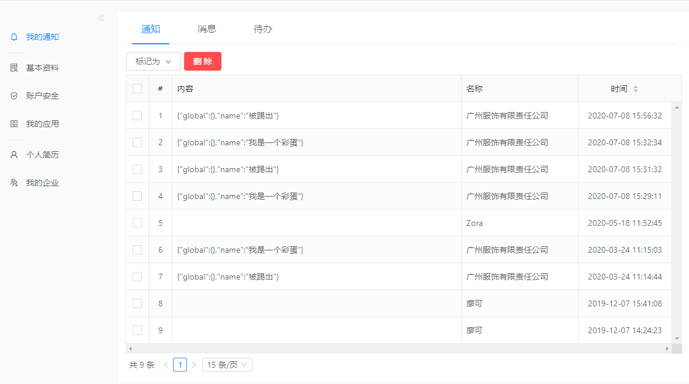

# 我的通知
列表当中展示

## 通知
发送的通知，只是查看的内容，包含内容页面

- 平台管理员发送的通知
- 企业管理员发送的通知
- 问题反馈结果通知
- 
- 注册平台账号的通知
- 申请注销个人账号的通知
- 注销个人账号的通知
- 个人实名认证成功、失败通知
- 账号停用的通知
- 
- 创建企业成功的通知
- 被邀请加入企业的通知
- 接收（移交后）企业成功的通知
- 企业申请解散的通知
- 企业成功解散的通知
- 被移出(停用员工)/被启用员工的通知
- 被同意/被拒绝申请加入企业的通知
- 应用权限开通、关闭的通知(购买不通知)
- 企业实名认证成功、失败的通知
- 企业停用的通知
-
- 应用支付(开通)成功的通知
- 平台停用的通知
- 应用过期15天/7天提醒
- 

## 消息
系统发送的消息，及时的，点击会跳转到对应的处理页面，消息就是标题

- 新用户申请加入企业
- 
- 

## 待办
用户个人的待办事项列表，可以任何地方快速增加和完成 